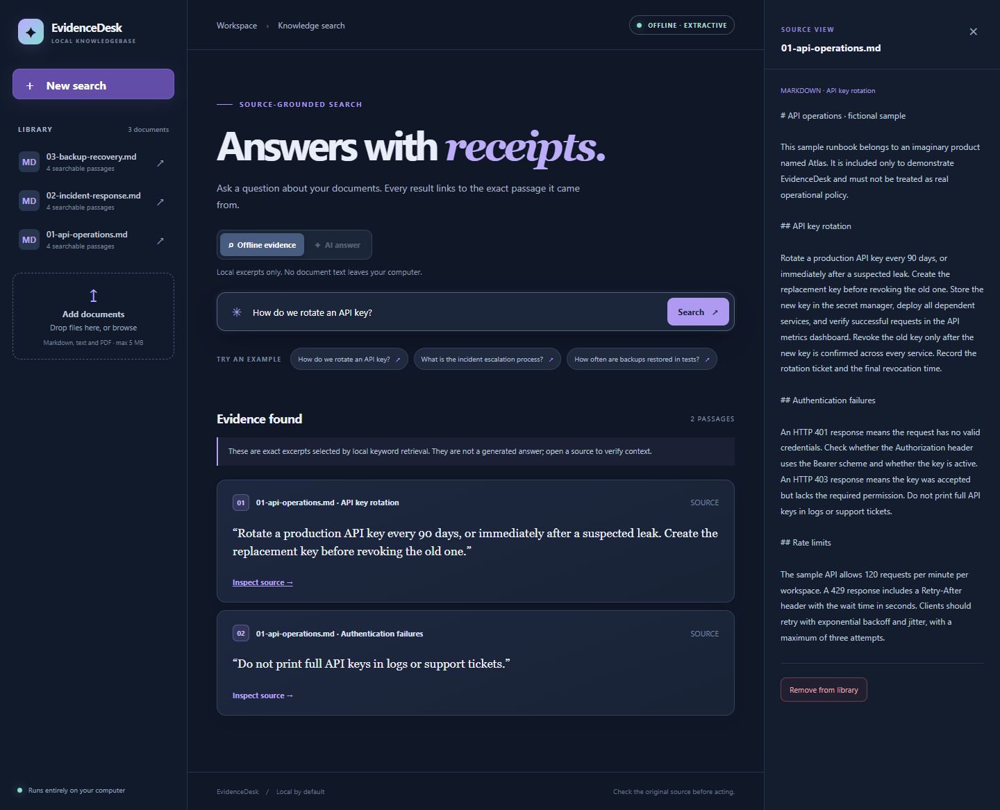
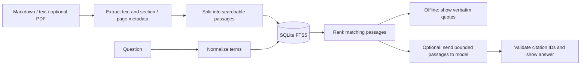

# EvidenceDesk

**A document question-answering app that shows its sources.** Upload Markdown, text or PDF files and inspect the passages behind every result. Offline evidence search works without a key; an optional OpenAI mode turns retrieved passages into a concise, cited answer.



## Why this project

Many knowledgebase demos require a paid API key and hide the source of a response. EvidenceDesk makes retrieval useful offline and every passage inspectable, then adds a clearly separated RAG mode for users who choose to enable it. It demonstrates document ingestion, full-text indexing, bounded context construction, a structured LLM response, citation validation, HTTP API design, and behavior-focused tests.

## Features

- **Offline by default:** Python standard library and SQLite FTS5 power the text and Markdown workflow. No account, key, model download or cloud service is needed.
- **Optional RAG answer:** When `OPENAI_API_KEY` is set on the server, retrieved passages can be sent to the OpenAI Responses API for a concise answer with `[S1]`-style citations. The key stays server-side.
- **Source-grounded results:** Every result is a verbatim excerpt with document name, section and page (for PDFs). Open the full source from each result.
- **Live document library:** Add and remove `.md` and `.txt` files in the browser. Optional `pypdf` adds text-based PDF support. Duplicate content is detected by SHA-256.
- **Search that stays current:** SQLite triggers update the FTS5 index as documents are added or removed.
- **Honest failure state:** The offline mode returns “no match” when retrieval finds nothing. RAG mode explicitly declines to answer when evidence is insufficient or citations are invalid.

## Run locally

Requires **Python 3.10+** with SQLite FTS5, which is included in standard Python distributions on Windows, macOS and most Linux installations.

```bash
cd evidence-rag
python -m app.server
```

Open **http://127.0.0.1:8765**. On first launch, three fictional sample runbooks are loaded automatically. The SQLite database is stored in `data/evidencedesk.sqlite`; delete that file to reset the demo.

To enable browser uploads of text-based PDFs:

```bash
python -m pip install -r requirements-pdf.txt
```

Scanned PDFs need OCR before upload. For a different port or database location, use `python -m app.server --port 9000 --db path/to/data.sqlite`.

## Optional AI answer mode

Set an OpenAI API key **on the server**, then restart EvidenceDesk. The **AI answer** button becomes available. For PowerShell:

```powershell
$env:OPENAI_API_KEY = "your-api-key"
python -m app.server
```

For macOS/Linux:

```bash
export OPENAI_API_KEY="your-api-key"
python -m app.server
```

The default model is `gpt-4o-mini`; no other package is needed. Get a key from the [OpenAI API dashboard](https://platform.openai.com/api-keys). Do not put a real key in the repository or browser. The server sends **up to four retrieved passages, at most 900 characters each**, plus the question. It requests `store: false` and caps the answer at 450 output tokens. A question with no retrieved passages makes **no API call**. The optional mode uses the [Responses API with structured output](https://developers.openai.com/api/docs/guides/structured-outputs); the server checks that every returned citation refers to a supplied source ID. This checks citation references, not factual correctness, so read the linked passages before acting.

**Cost:** Offline search costs nothing beyond running the computer. Each AI answer request uses billable API tokens. As of **2026-09-21**, the [published `gpt-4o-mini` text rates](https://developers.openai.com/api/docs/models/gpt-4o-mini) are **$0.15 per 1 million input tokens** and **$0.60 per 1 million output tokens**. For illustration, 2,000 input tokens and 200 output tokens cost `2000 × $0.15 / 1,000,000 + 200 × $0.60 / 1,000,000 = $0.00042`. Actual usage varies; check current pricing and your API usage dashboard. The API key is never returned to the frontend. Only selected passages are sent in AI mode; the default mode remains local.

## Try the demo

The sample documents are **fictional** and exist only to demonstrate retrieval. Try:

1. “How do we rotate an API key?”
2. “What is the incident escalation process?”
3. “How often are backups restored in tests?”

Click **Inspect source** to compare an excerpt with the full runbook. Upload your own `.md` or `.txt` document to explore another topic.

## API

| Endpoint | Purpose |
| --- | --- |
| `GET /api/health` | Health and search mode |
| `GET /api/documents` | Document names and passage counts |
| `GET /api/documents/{id}` | Full extracted document text |
| `POST /api/documents` | Add a document (`name`, `content`; PDFs also need `encoding: "base64"`) |
| `DELETE /api/documents/{id}` | Remove a document and its search index entries |
| `POST /api/ask` | Search with `{"query": "..."}`; add `"mode": "rag"` for optional AI answers |

Example:

```bash
curl -s http://127.0.0.1:8765/api/ask \
  -H "Content-Type: application/json" \
  -d '{"query":"How do we rotate an API key?"}'
```

The default response includes `status` (`found`, `no_match`, or `empty_query`) and an `evidence` array. Each evidence item contains a verbatim `quote`, its surrounding `context`, and a source reference. With `"mode": "rag"`, the response includes `status` (`answered`, `no_answer`, or `empty_query`), an `answer`, citation IDs, and the passages sent to the model. A provider failure returns a generic `502` error without exposing the key or the upstream response.

## How retrieval works



The app uses FTS5 with Unicode and Porter tokenization plus BM25 ranking. It is *lexical* retrieval: synonyms and complex reasoning may be missed. The default mode extracts verbatim sentences and never calls an LLM. The optional mode generates an answer only from the retrieved passages, but an LLM can still make mistakes. For sensitive decisions, read the full source.

## Test

```bash
python -m unittest discover -s tests -v
```

The tests check retrieval accuracy, source citations, no-match behavior, index updates, PDF page markers, the HTTP document lifecycle, bounded RAG input, citation validation, abstention, and sanitized provider errors. RAG tests use a mocked transport and make no paid API calls.

## Project structure

```text
app/             SQLite ingestion, retrieval, optional RAG client, local HTTP server
static/          Responsive browser interface
seed/            Clearly labeled fictional runbooks
tests/           Retrieval and HTTP integration tests
requirements-pdf.txt  Optional PDF text extraction dependency
```

## Notes

EvidenceDesk binds to `127.0.0.1` by default and has no authentication. It is intended for a single user on their own computer. The local database contains the text of uploaded documents; use the remove control or delete the database when finished. In AI mode, the selected passages leave your computer for the API. The demo is not a hosted SaaS application.

MIT licensed. Built by Javier García Rey.
